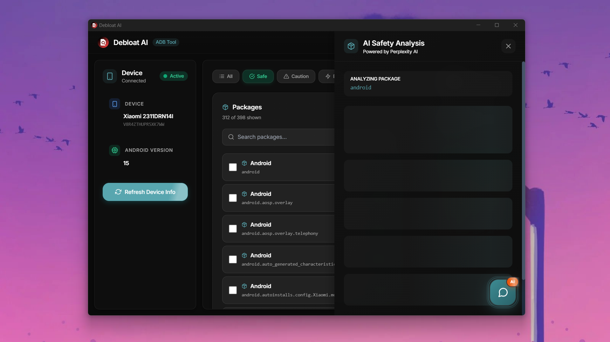
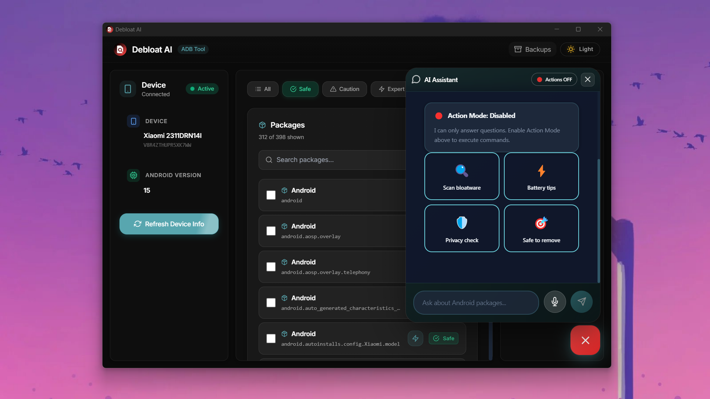
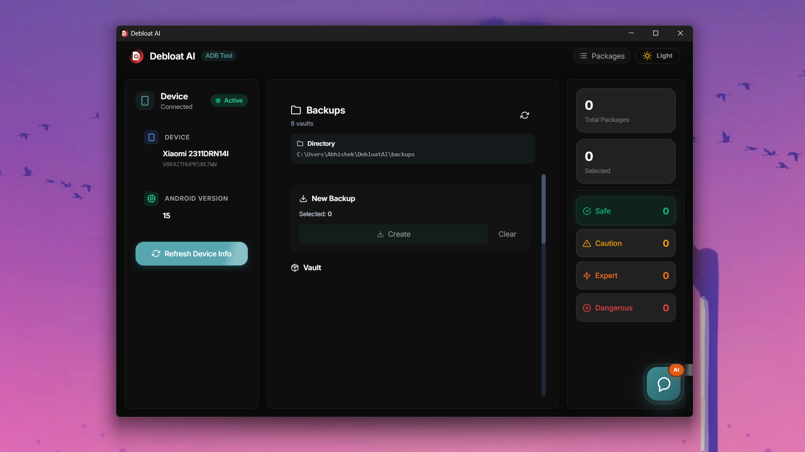

<p align="center">
  
</p>

<h1 align="center">Debloat AI</h1>

<p align="center">
  <strong>Just tell it what to do. AI handles the rest.</strong>
</p>

<p align="center">
  <a href="https://github.com/abhishek112007/debloat-ai/releases"></a>
  <a href="LICENSE"></a>
  
  
  
  
</p>

<p align="center">
  The first AI-powered Android debloater. Remove bloatware using natural language commands.<br>
  Type <code>"remove all Facebook apps"</code> and watch it happen.
</p>

---

## OpenClaw — Talk to Your Phone

**OpenClaw** is the core of Debloat AI. Instead of scrolling through hundreds of packages and guessing which ones are safe to remove, just tell the AI what you want:

```
> remove all xiaomi bloatware
```

The AI understands your intent, identifies matching packages, checks safety ratings, and asks for confirmation before touching anything.

### What You Can Say

| Command | What Happens |
|---------|-------------|
| `remove facebook and instagram` | Finds and queues both apps for removal |
| `scan for bloatware` | AI scans all packages, flags safe-to-remove ones |
| `what is com.miui.analytics` | Returns safety analysis with risk level |
| `backup everything before cleanup` | Creates a full backup of current state |
| `restore com.google.chrome` | Reinstalls a previously removed package |
| `remove all xiaomi tracking apps` | AI identifies tracking-related packages |

### How It Works

```
You type a command
    ↓
OpenClaw parses intent + entities
    ↓
AI validates safety (powered by Perplexity)
    ↓
Shows you exactly what will happen
    ↓
You confirm → Action executes
```

Every destructive action requires explicit confirmation. The AI will warn you if a package is critical to system stability.

### Action Mode

Toggle **Action Mode** ON to let the chatbot execute commands directly. Toggle it OFF to use the chatbot as an advisor only — it will analyze and recommend, but won't touch your device.

| Mode | Behavior |
|------|----------|
| **Action Mode ON** | AI can remove, restore, and backup packages after confirmation |
| **Action Mode OFF** | AI only answers questions and provides analysis |

---

## Features

- **AI Chat Interface** — Natural language interaction powered by Perplexity AI
- **Smart Package Analysis** — AI-powered safety ratings for every package
- **One-Click Debloat** — Select and remove multiple packages at once
- **Backup & Restore** — Full backup before any changes, one-click restore
- **Real-Time Device Detection** — Auto-detects connected Android devices via ADB
- **Beautiful UI** — Glassmorphism design with light/dark themes
- **Safe by Default** — Multi-layer confirmation, risk warnings, Action Mode toggle

---

## Screenshots

<p align="center">
  
  <br>
  <em>Smart package categorization with 398 packages analyzed and sorted by safety levels</em>
</p>

<p align="center">
  
  <br>
  <em>AI Assistant with Action Mode toggle and quick action buttons for common tasks</em>
</p>

<p align="center">
  
  <br>
  <em>Real-time AI safety analysis powered by Perplexity AI</em>
</p>

<p align="center">
  
  <br>
  <em>Comprehensive backup system with 8 vaults for safe package restoration</em>
</p>

---

## Quick Start

### Prerequisites

- **ADB** installed and in your PATH — [Download Platform Tools](https://developer.android.com/tools/releases/platform-tools)
- **USB Debugging** enabled on your Android device
- **Perplexity API Key** for AI features — [Get one here](https://www.perplexity.ai/settings/api)

### Install

Download the latest installer from [**Releases**](https://github.com/abhishek112007/debloat-ai/releases):

| Platform | Download |
|----------|----------|
| Windows | `DebloatAI-Setup-x.x.x.exe` |
| Linux | `DebloatAI-x.x.x.AppImage` |
| macOS | `DebloatAI-x.x.x.dmg` |

### First Run

1. Connect your Android device via USB
2. Accept the USB debugging prompt on your phone
3. Launch Debloat AI
4. Open Settings (gear icon) and enter your Perplexity API key
5. Start typing commands in the chat — try `scan for bloatware`

---

## Development Setup

```bash
# Clone
git clone https://github.com/abhishek112007/debloat-ai.git
cd debloat-ai

# Install dependencies
npm install
cd frontend && npm install && cd ..

# Python backend
cd backend-python
python -m venv .venv
.venv/Scripts/activate        # Windows
# source .venv/bin/activate   # Linux/macOS
pip install -r requirements.txt

# Configure AI
echo PERPLEXITY_API_KEY=your_key_here > .env
cd ..

# Run
npm run dev
```

### Build for Production

```bash
npm run build                 # Full build → installer
npm run build:frontend        # Vite production build
npm run build:backend         # PyInstaller → backend.exe
npm run build:electron        # electron-builder → installer
```

---

## Architecture

```
┌──────────────────────────────────────────┐
│              Electron Shell              │
│                                          │
│  ┌────────────────┐ ┌────────────────┐  │
│  │  React + Vite   │ │ Python Backend │  │
│  │  (Renderer)     │ │ (IPC / stdio)  │  │
│  │                 │ │                │  │
│  │  Chat UI        │ │ ADB Operations │  │
│  │  Package List   │ │ AI Advisor     │  │
│  │  Backup Manager │ │ OpenClaw NLP   │  │
│  │  Theme Engine   │ │ Backup Manager │  │
│  └────────┬───────┘ └───────┬────────┘  │
│           │   JSON / stdio   │           │
│           └──────────────────┘           │
└──────────────────────────────────────────┘
```

| Layer | Technology |
|-------|-----------|
| Desktop Shell | Electron 28 |
| Frontend | React 18 · TypeScript 5.3 · Vite 5 |
| Styling | Tailwind CSS 3.4 · Framer Motion |
| Backend | Python 3.10+ · ADB |
| AI Engine | Perplexity API (Sonar model) |
| NLP | OpenClaw — regex intent + entity extraction |
| Build | PyInstaller · electron-builder |
| CI/CD | GitHub Actions |

### Project Structure

```
debloat-ai/
├── electron/                  # Electron main process
│   ├── main.js                #   Window management, Python IPC
│   └── preload.js             #   Secure bridge to renderer
├── frontend/src/              # React application
│   ├── components/            #   Chat, Packages, Backup, Themes
│   ├── hooks/                 #   Device monitoring, toast, dark mode
│   ├── styles/                #   CSS themes and animations
│   ├── utils/                 #   API client, helpers
│   └── types/                 #   TypeScript definitions
├── backend-python/            # Python backend
│   ├── main.py                #   IPC command router
│   ├── adb_operations.py      #   Device + package management
│   ├── ai_advisor.py          #   Perplexity / OpenAI integration
│   ├── openclaw_integration.py #  Natural language → action engine
│   └── backup_manager.py      #   Backup / restore logic
├── openclaw-skill/            # OpenClaw external skill definition
├── docs/                      # Detailed documentation
├── icons/                     # App icons (all platforms)
├── scripts/                   # Build utilities
└── .github/workflows/         # CI/CD release pipeline
```

---

## Documentation

| Document | Description |
|----------|-------------|
| [OpenClaw Integration](docs/OPENCLAW_INTEGRATION.md) | Full technical spec of the command engine |
| [Quick Start — Commands](docs/QUICK_START_OPENCLAW.md) | Command examples and usage patterns |
| [Action Mode Safety](docs/ACTION_MODE_SAFETY.md) | Safety layers and risk levels explained |
| [Architecture](docs/ARCHITECTURE.md) | System design, data flow, IPC protocol |
| [Installation Guide](docs/INSTALL.md) | Platform-specific install instructions |
| [ADB Setup](docs/ADB_SETUP_GUIDE.md) | ADB driver installation & troubleshooting |
| [Contributing](CONTRIBUTING.md) | Dev guidelines and PR process |
| [Changelog](CHANGELOG.md) | Version history |

---

## Contributing

We welcome contributions! See [CONTRIBUTING.md](CONTRIBUTING.md) for coding standards, branch naming, and PR process.

```bash
npm run dev    # Start with hot reload
```

---

## License

[MIT](LICENSE) — Built by [Abhishek](https://github.com/abhishek112007)
